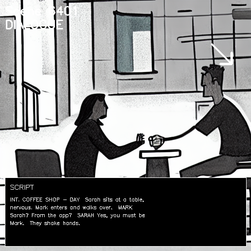

# Script-to-Storyboard Generation System

An AI-powered system that converts film scripts into visual storyboards using NLP, computer vision, and deep learning.

## Features

- Script parsing and scene segmentation
- Emotion and action analysis
- Scene classification for dialogue and action moments
- Visual storyboard generation with generated frames
- Example script and output assets included in the repository

## Example Output

The repository now includes a sample input script and a generated storyboard example.



- Sample input script: [examples/sample_script.txt](examples/sample_script.txt)
- Generated storyboard PDF: [examples/storyboard-example.pdf](examples/storyboard-example.pdf)
- Additional storyboard frames: [examples/scene_001.png](examples/scene_001.png) to [examples/scene_006.png](examples/scene_006.png)

## Project Structure

```text
script2storyboard/
├── src/
│   ├── nlp/              # NLP processing modules
│   ├── vision/           # Computer vision and image generation
│   └── api/              # API endpoints and services
├── examples/            # Example scripts and generated storyboard assets
├── tests/               # Unit tests
└── output/              # Generated storyboard outputs
```

## Setup

1. Create and activate a virtual environment:
```bash
python -m venv venv
venv\Scripts\activate
```

2. Install dependencies:
```bash
pip install -r requirements.txt
```

3. Download the spaCy model if needed:
```bash
python -m spacy download en_core_web_lg
```

## Usage

Run the generator with any script file:

```bash
python src/main.py --script path/to/script.txt
```

The generated storyboard PDF will be written to the output folder.

## License

MIT License